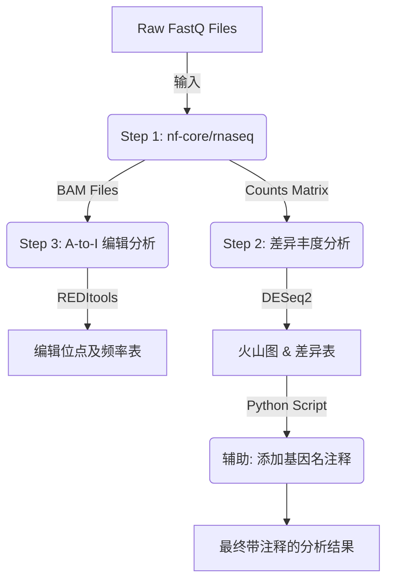

# RNA-seq-and-AtoI

gemini生成的文档。如遇冲突，已代码实际内容为准。
---

# 🧬 集成化 RNA-Seq 与 A-to-I RNA 编辑分析全流程

本项目提供了一套完整的、针对高性能计算集群 (HPC/SLURM) 优化的转录组分析工作流。主要针对 **小鼠 (GRCm39)** 数据，整合了三个核心分析模块：**RNA-Seq 定量**、**差异表达分析**以及**转录组水平 A-to-G (A-to-I) 编辑位点检测**。

## 🚀 核心特性

* **标准化定量 (Quantification):** 基于 `nf-core/rnaseq` (v3.21.0)，采用 **STAR + Salmon** 的黄金标准流程，确保比对与计数的准确性。
* **自动化差异分析 (Differential Analysis):** 基于 `nf-core/differentialabundance` (v1.5.0)，自动化完成归一化、PCA 分析及差异检验 (DESeq2)，并不仅限于生成原始数据。
* **智能注释增强:** 内置自定义 Python 脚本，自动将 Ensembl ID 转换为 Gene Symbol，直接生成可用于发表的结果表格。
* **A-to-I 编辑检测与负载均衡:** 集成 `REDItools` (Python版)，独创 **Smart Load Balancing (智能负载均衡)** 策略，自动识别高深度样本（如 mtDNA 或高表达基因），防止计算节点内存溢出 (OOM)。
* **HPC 环境适配:** 所有脚本均针对 SLURM 调度器优化，包含本地缓存 (`singularity_cache`) 和临时目录 (`tmpdir`) 管理，解决集群常见的 I/O 和权限问题。

---

## 📋 流程概览



---

## 🛠️ 环境依赖与安装

请确保您的 HPC `miniconda3` 中已配置以下环境：

1. **Nextflow 环境 (`env_nf`)**:
* 包含 Nextflow, Singularity, Java。
* 用于运行 nf-core 流程。


2. **REDItools 环境 (`reditools`)**:
* 包含 `reditools` (v3), `pysam`, `parallel` (GNU parallel)。
* 用于运行 A-to-I 编辑分析。


3. **工具环境 (`my_tools`)**:
* 包含 `pandas`, `biopython`。
* 用于运行辅助脚本和注释脚本。

## 🧬 基因组和注释文件准备

不同来源的文件在格式和内容上都会有不同，因此两者需要通过**相同来源**下载。
推荐使用ensembl数据库下载。https://www.ensembl.org/
小鼠基因组：Mus_musculus.GRCm39.dna_sm.primary_assembly.fa.gz;
小鼠基因组注释文件：Mus_musculus.GRCm39.115.gtf.gz
人基因组：Homo_sapiens.GRCh38.dna_sm.primary_assembly.fa.gz;
人基因组注释文件：Homo_sapiens.GRCh38.115.gtf.gz

---

## 📂 1. RNA-Seq 定量分析

**目标:** 将原始测序数据比对到参考基因组，并生成基因表达矩阵。

### 1.1 输入准备

创建 `samplesheet.csv`，格式严格遵循 nf-core 标准：

| sample | fastq_1 | fastq_2 | strandedness |
| --- | --- | --- | --- |
| IR_1 | /path/to/R1.fq.gz | /path/to/R2.fq.gz | auto |

* `strandedness`: 推荐设为 `auto`，流程会自动检测链特异性。

### 1.2 运行流程

使用 `sbatch` 提交任务。此步骤将自动下载必要的 Singularity 镜像。

```bash
sbatch nextflow_rnaseq.sh

```

**关键配置说明 (`nextflow_ranseq.config`):**

* **STAR_GENOMEGENERATE:** 单独分配 80GB 内存和 12 CPU，以满足构建 GRCm39 索引的需求。
* **Local Executor:** 任务在申请的计算节点本地运行，避免重复向 SLURM 提交大量小任务。
* **输出产物:**
* `nf_output_rnaseq/star_salmon/salmon.merged.gene_counts.tsv`: **差异分析的输入**。
* `nf_output_rnaseq/star_salmon/*.markdup.sorted.bam`: **A-to-I 编辑分析的输入**。


---

## 📊 2. 差异丰度分析 (Differential Abundance)

**目标:** 基于 RNA-Seq 定量结果，识别不同分组间的差异表达基因 (DEGs)。

### 2.1 输入准备

1. **样本信息表 (`samplesheet_DA_basedon_ranseq.csv`):**
需包含 `condition` (分组), `replicate` (重复), `batch` (批次，可选)。
2. **对比矩阵表 (`contrasts_DA.csv`):**
定义具体的比较方案。
* `reference`: 对照组 (分母)。
* `target`: 实验组 (分子)。


### 2.2 运行分析

此步骤依赖 Step 1 的输出。

```bash
sbatch nextflow_DA_after_rnaseq_differentialabundance_.sh

```

### 2.3 后处理：添加基因注释

原生 DESeq2 结果仅包含 Ensembl ID。运行此辅助脚本将基因名 (Symbol) 添加到结果表中，方便阅读。

```bash
sbatch add_anno2deseq_results.sh

```

* **功能:** 自动扫描 `nf_output_DA.../tables` 目录，匹配 ID 并追加 `gene_name` 列。
* **最终结果:** 保存在 `nf_output_DA_basedon_ranseq/summary_for_visualization/` 目录下。

---

## 🧬 3. A-to-I RNA 编辑分析

**目标:** 在转录组水平检测 A-to-G 变异（即 A-to-I 编辑事件）。

本模块提供两种模式，请根据您的**测序深度**选择。

### 模式 A: 标准并行处理 (Standard)

适用于常规深度的转录组数据。利用 `parallel` 工具同时处理多个样本。

```bash
sbatch reditools_AtoI.sh

```

### 模式 B: 智能负载均衡 (Smart Load Balancing) 🌟推荐

适用于包含**超高深度样本**（如 mtDNA 深度 > 20,000X 或高表达基因）的数据集。

```bash
sbatch reditools_AtoI_for_extremeHigh_depth.sh

```

**智能分流机制:**

1. **分诊 (Triage):** 脚本首先使用 `samtools depth` 快速扫描所有 BAM 文件。
2. **分类 (Classification):**
* **普通样本:** 进入“并行通道”，高效并发处理（如 6 个任务 × 4 线程）。
* **重症样本 (Heavy):** 进入“独占通道”，串行处理但独占所有计算资源（1 个任务 × 24 线程），防止内存溢出。


3. **分析:** 调用 `REDItools` Python 模块进行位点遍历。

**输出结果:**

* `reditools_output/*_analyze_reditools.txt`: 包含每个位点的碱基计数信息。

---

## 📂 项目目录结构建议

建议保持以下目录结构，以便脚本自动寻找路径：

```text
Project_Root/
├── nextflow_rnaseq.sh              # [脚本] 步骤 1 启动脚本
├── nextflow_ranseq.config          # [配置] 步骤 1 参数配置
├── nextflow_DA_..._.sh             # [脚本] 步骤 2 启动脚本
├── nextflow_DA_..._.config         # [配置] 步骤 2 参数配置
├── reditools_AtoI.sh               # [脚本] 步骤 3 (标准模式)
├── reditools_AtoI_smart.sh         # [脚本] 步骤 3 (高深度模式)
├── add_anno2deseq_results.sh       # [脚本] 辅助：添加注释
├── samplesheet.csv                 # [数据] 步骤 1 输入表
├── samplesheet_DA...csv            # [数据] 步骤 2 输入表
├── contrasts_DA.csv                # [数据] 步骤 2 对比矩阵
├── Mus_musculus.GRCm39...gtf.gz    # [参考] 基因组注释
├── Mus_musculus.GRCm39...fa.gz     # [参考] 基因组序列
└── nf_output_rnaseq/               # [输出] 步骤 1 自动生成
    └── star_salmon/
        ├── salmon.merged.gene_counts.tsv
        └── *.markdup.sorted.bam    # 步骤 3 的输入文件

```

---

## 📝 结果解读指南

### 1. 差异表达表 (`*.anno.tsv`)

位于 `summary_for_visualization` 文件夹中。

| 列名 (Column) | 含义 |
| --- | --- |
| `gene_id` | Ensembl 基因 ID (如 ENSMUSG00000001) |
| `gene_name` | **Gene Symbol (如 Apoe, 脚本自动添加)** |
| `baseMean` | 所有样本的归一化平均计数 |
| `log2FoldChange` | 变化倍数的对数值 (正值代表在 Target 组上调) |
| `pvalue` | 原始 P 值 |
| `padj` | FDR 校正后的 P 值 (通常取 < 0.05 为显著) |

### 2. REDItools 输出 (`*_analyze_reditools.txt`)

包含每个基因组位置的碱基分布。计算 A-to-I 编辑率的公式如下：

*(注意：在 cDNA 测序中，A-to-I 编辑表现为 A 变为 G)*

---

## ⚠️ 常见问题排查 (Troubleshooting)

1. **临时目录空间不足 (`No space left on device`):**
* 本流程已在 config 文件中通过 `tmpdir = "$PWD/global_tmp"` 将临时目录重定向到当前工作目录，避免了使用系统 `/tmp`。请确保当前目录所在磁盘空间充足。


2. **REDItools 运行缓慢或卡死:**
* 原因通常是某些位点深度极高（如线粒体基因）。
* **解决方案:** 请务必使用 `reditools_AtoI_for_extremeHigh_depth.sh`，它会自动为这些样本分配更多资源。


3. **断点续传:**
* Nextflow 脚本均包含 `-resume` 参数。如果任务因故中断（如时间超时），修改 SBATCH 时间后直接重新提交即可，流程会从断点处继续运行，不会从头开始。


---

**维护者:** sunxiaozhi
**版本:** 1.0.0
